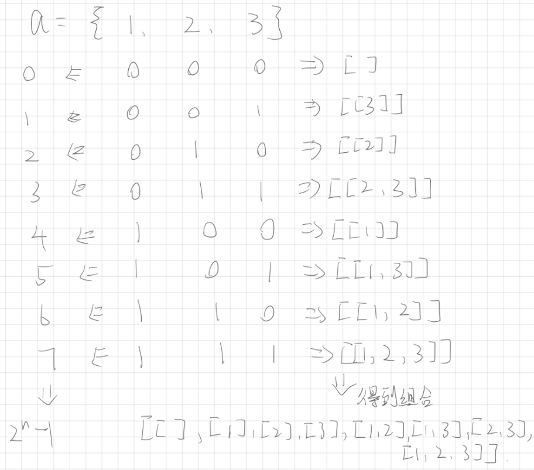
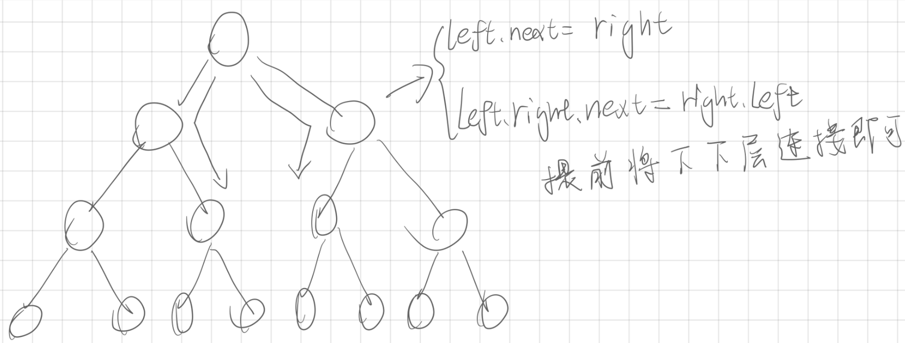
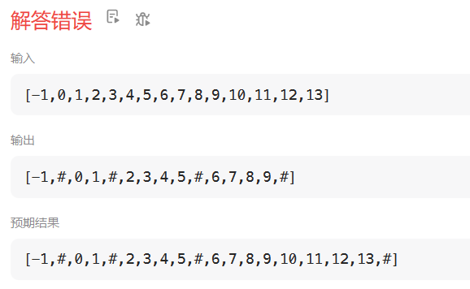
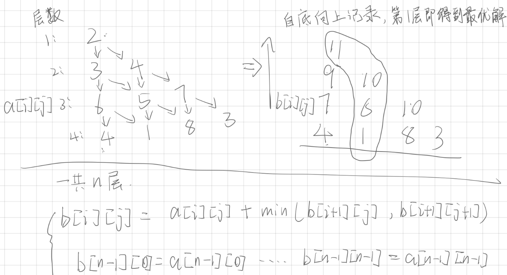

# 题目

## 数组/字符串

### [13. 罗马数字转整数](https://leetcode.cn/problems/roman-to-integer/)

>字符串

```java
package leetcode;

public class T13 {
	public static void main(String[] args) {
		
		T13T solution = new T13T();
		System.out.println(solution.romanToInt("MCMXCIV"));
	}
	
	
}

class T13T {
	
	static char[] c = {'I', 'V', 'X', 'L', 'C', 'D', 'M', '0'};
	static int[] num = {1, 5, 10, 50, 100, 500, 1000, 0};
	
    public int romanToInt(String s) {
    	int sum = 0;	//记录总和
    	
    	s = 0 + s;//处理开头
    	
    	boolean flag = false;//用来标记是否是特殊情况
    	
    	int a = 0, b = 0;
    	for (int i = 1; i < s.length(); ++i) {
    		if (flag) {//特殊情况
    			flag = false;//重置
    			
    			a = findSort(s.charAt(i));
    			b = findSort(s.charAt(i - 1));
    			
    			sum += num[a] - 2 * num[b];
    			
    		} else {
    			a = findSort(s.charAt(i));
    			b = findSort(s.charAt(i - 1));
    			if (a > b) {
    				flag = true;
    				i--;
    			} else {
					sum += num[a];
				}	
    		}
    	}
    	
		return sum;
    }
    
    //找到字母对应的次序
    public static int findSort(char al) {
    	
    	int k = 7;
    	
    	for (int i = 0; i < c.length; ++i) {
    		if (al == c[i]) {
    			return i;
    		} 
    	}
    	
    	return k;
    }
}
```


### [88. 合并两个有序数组](https://leetcode.cn/problems/merge-sorted-array/description/?envType=study-plan-v2&envId=top-interview-150) 

> 数组、双指针、排序

先将num1的m个元素移到num的后m位，再从头对比num1和num2的元素大小，小的放num1前面

```java
package leetcode;

import org.junit.jupiter.api.Test;

public class T88 {

	@Test
	public void testMerge() {
		
		/*
		 * int[] a = {1,2,3,0,0,0}; int[] b = {2,5,6}; int m = 3, n = 3;
		 */
		int[] a = {2,0};
		int[] b = {1};
		int m = 1, n = 1;
		
		merge(a, m, b, n);
		
		for (int i = 0; i < m + n; i++) {
			System.out.println(a[i]);
		}
		
	}

	public void merge(int[] nums1, int m, int[] nums2, int n) {
		
		// 特判
		if (m == 0) {
			for(int i = 0; i < n; ++i) {
				nums1[i] = nums2[i]; 
			}
		} else if (n == 0) {
			return;
		}

		// 先将nums1的元素都放后面
		for (int i = m + n - 1, j = m - 1; j >= 0; i--, j--) {
			nums1[i] = nums1[j];
		}
		

		// 从头对比nums1和nums2的元素大小
		int flag = 0;
		for (int i = n, j = 0; i < n + m && j < n;) {
			if (nums1[i] <= nums2[j]) {
				nums1[flag++] = nums1[i++];
			} else {
				nums1[flag++] = nums2[j++];
			}
			
			// 判断是否有一个列表用完
			if (i == n + m) {
				while (j < n) {
					nums1[flag++] = nums2[j++];
				}
			} else if (j == n){
				while (i < n + m) {
					nums1[flag++] = nums1[i++];
				}
			}
		}

	}
}

```

### [58. 最后一个单词的长度](https://leetcode.cn/problems/length-of-last-word/submissions/515550590/?envType=study-plan-v2&envId=top-interview-150)

> 字符串

```java
package com.lrh.leetcode;

import org.junit.jupiter.api.Test;

import java.util.regex.Matcher;
import java.util.regex.Pattern;

public class T58_LengthOfLastWord {
    @Test
    public void Test() {
        
    }

    /**
     * 用工具类实现
     * TODO 用纯字符串操作实现
     * @param s
     * @return
     */
    public int lengthOfLastWord(String s) {
        Pattern pattern = Pattern.compile("\\b\\w+\\b");
        Matcher matcher = pattern.matcher(s);
        String lastWord = null;
        while (matcher.find()) {
            lastWord = matcher.group();
        }

        return lastWord.length();
    }
}

```

### [28. 找出字符串中第一个匹配项的下标](https://leetcode.cn/problems/find-the-index-of-the-first-occurrence-in-a-string/submissions/535540775/?envType=study-plan-v2&envId=top-interview-150) 

> 字符串、双指针

```java
class Solution {
    public int strStr(String haystack, String needle) {
        
        for (int i = 0; i <= haystack.length() - needle.length(); i++) {

            // a指向haystack的元素與bneedle指向的元素進行比對
            int a = i, b = 0;

            for (int j = 0; j < needle.length(); j++) {
                if (haystack.charAt(a) == needle.charAt(j)) {
                    a++;
                    b++;
                    if (b == needle.length()) {
                        return i;
                    }
                } else {
                    break;
                }
            }

        }
        // 沒找到
        return -1;
    }
}
```


### [14. 最长公共前缀](https://leetcode.cn/problems/longest-common-prefix/)

> 字典树


---

## 双指针

### [26. 删除有序数组中的重复项](https://leetcode.cn/problems/remove-duplicates-from-sorted-array/)

> 双指针

快慢指针i和j，i指针前的元素都不重复，j指针往后找不重复的元素，不重复的元素放到i指针的下一个位置

```java
package leetcode;

public class T26 {
	public static void main(String[] args) {
		new T26().new Solution().removeDuplicates(new int[] {1, 2});
	}
	
	class Solution {
	    public int removeDuplicates(int[] nums) {

	        int k = nums.length;

	        int i = 0, j = 0;//快慢指针
	        
	        for (j = 0; j < k; ++j) {
	        	if (nums[j] != nums[i]) {
	        	
					if (i + 1 < k) {
						nums[i + 1] = nums[j];
						i++;
					}
				}
	        }

	        return nums.length == 0 ? 0 : i + 1;//返回的是数组长度，要考虑数组长度为0的情况
	    }
	}

}

```

### [27.移除元素](https://leetcode.cn/problems/remove-element/)

> 双指针

快慢指针i和j，i指针前的元素不需要移除，j往后寻找不要移除的元素，找到就放在i的位置，然后i往后移动，直到j遍历完数组

```java
class Solution {
	    public int removeElement(int[] nums, int val) {

	    	int k = nums.length;
	    	
	    	int i = 0, j = 0;
	    	
	    	for (j = 0; j < k; ++j) {
	    		if (nums[j] != val) {
	    			nums[i] = nums[j];
	    			i++;
	    		}
	    	}
	    	
	    	return i;
	    }
	}
```

```java
package com.lrh.leetcode;

import org.junit.jupiter.api.Test;

/*
 * @author      : pumpkins
 * @date        : 2024/3/19 0:16
 * @description : 双指针
 */
public class T27RemoveElement {

    @Test
    public void test() {
        int[] nums = {0,1,2,2,3,0,4,2};
        int val = 2;

        int i = removeElement(nums, val);

        for (int j = 0; j < i; j++) {
            System.out.println(nums[j]);
        }
    }

    public int removeElement(int[] nums, int val) {

        int i = 0;
        for (int j = 0; j < nums.length; ++j) {
            if (nums[j] != val) {
                nums[i++] = nums[j];
            }
        }

        return i;
    }
}

```


### [80. 删除有序数组中的重复项 II](https://leetcode.cn/problems/remove-duplicates-from-sorted-array-ii/description/?envType=study-plan-v2&envId=top-interview-150)

> 双指针

```java
public int removeDuplicates(int[] nums) {
        // 计数器，当j找到的元素出现次数超过2时就不允许i再填充这个元素
        int cut = 0;
        // 双指针，i用来填充，j用来查找满足条件的元素
        int i = 0;

        for (int j = 0; j < nums.length; ) {
            if (nums[i] == nums[j] && cut < 2) {
                if (i > 0 && nums[i - 1] != nums[i]) {
                    cut = 1;
                } else {
                    cut++;
                }
                i++;
                j++;
            } else if (nums[i] == nums[j] && cut >= 2) {
                if (nums[i - 1] != nums[i]) {
                    i++;
                    cut = 1;
                }
                j++;
            } else if (nums[i] != nums[j]) {
                nums[i] = nums[j];
                // 应该抹去中间的其他值 比如 0 0 1 1 1 1 1 2 2 2 4，
                // 得到中间状态 0 0 1 1 2 1 1 2 2 2 4时，i等于4，j等于7时，
                // 如果不将中间的1清除改为2，后面cut变化会错误
                for (int k = i + 1; k < j; k++) {
                    nums[k] = nums[i];
                }

                i++;
                j++;
                cut = 1;
            }
        }

        return i;
    }
```


很暴力，思路很乱，待改进


### [169. 多数元素](https://leetcode.cn/problems/majority-element/description/?envType=study-plan-v2&envId=top-interview-150)

> 数组

笨方法：先排序，然后检查第1个元素和第n/2个元素如果两个位置上的元素相同就返回这位置上的元素，如果还不同就检查第i个元素和第n/2+i个元素，i不大于n/2，j不大于n

```java
/**
     * 笨方法：先排序，然后检查第1个元素和第n/2个元素如果两个位置上的元素相同就返回这位置上的元素
     * 如果还不同就检查第i个元素和第n/2+i个元素，i不大于n/2
     * TODO 太慢了，待优化
     * @param nums
     * @return
     */
    public int majorityElement(int[] nums) {

        Arrays.sort(nums);

        int ans = 0;
        for (int i = 0, j = nums.length / 2;j < nums.length && i <= nums.length / 2; ++i, ++j) {
            if (nums[i] == nums[j]) {
                ans = nums[i];
                break;
            }
        }

        return ans;
    }
```

优化后：

```java
```


### [125. 验证回文串 - 力扣（LeetCode）](https://leetcode.cn/problems/valid-palindrome/description/?envType=study-plan-v2&envId=top-interview-150)

> 双指针、字符串

特判字符串长度为0和1的情况。

其他情况则用双指针，i和j，一头一尾，当同时找到字母时才开始比较（这里用flag控制），比较前一律转为大写或小写。

```java
class Solution {
    public boolean isPalindrome(String s) {

        // 特判：
        if (s.length() == 1 || s.length() == 0) {
            return true;
        }

        for (int i = 0, j = s.length() - 1; i <= j; ) {

            // flag为true时找到两个字母
            boolean flag = true;
            char head = s.charAt(i);
            char tail = s.charAt(j);

            if (!Character.isLetterOrDigit(head)) {
                i++;
                flag = false;
            }
            if (!Character.isLetterOrDigit(tail)) {
                j--;
                flag = false;
            }

            if (flag) {
                head = Character.toLowerCase(head);
                tail = Character.toLowerCase(tail);
                if (head == tail) {
                    i++;
                    j--;
                } else {
                    return false;
                }
            }

        }
        return true;
    }
}
```


### [392. 判断子序列](https://leetcode.cn/problems/is-subsequence/)

> 双指针、字符串

```java
public boolean isSubsequence(String s, String t) {
        if (s.length() > t.length()) {
            return false;
        }

        int flag = 0;

        for (int i = 0; flag < s.length() && i < t.length(); i++) {
            if (s.charAt(flag) == t.charAt(i)) {
                flag++;
            }
        }

        return flag == s.length();
    }
```

进阶：如果有大量输入的 S，称作 S1, S2, ... , Sk 其中 k >= 10亿，你需要依次检查它们是否为 T 的子序列。在这种情况下，你会怎样改变代码？

动态规划：https://www.cnblogs.com/arknights/articles/13387155.html


### [11. 盛最多水的容器](https://leetcode.cn/problems/container-with-most-water/)

> 双指针、数组、贪心

**暴力解法**：双重循环枚举所有 `(i, j)` 组合，时间复杂度 O(n²)，对于 n≈5.7万 的测试数据必然超时。

**双指针解法**：初始化 `i=0, j=height.length-1`，每次移动高度较小的指针（因为容积受限于较矮的线），直到两指针相遇。时间复杂度 O(n)，空间复杂度 O(1)。

**正确性证明**：移动较高指针只会减少宽度，可能增加也可能减少高度；移动较矮指针虽然宽度减小1，但可能找到更高的线，从而增加容积。不会错过最优解。

```java
package com.lrh.leetcode;

import org.junit.Test;

/**
 * 双指针：
 * 初试时左指针指向最左端，右指针指向最右，往中间靠，每次移动指向最矮线条的指针
 */
public class T11_ContainerWithMostWater {
    // 果然超时了
    public int maxArea_timeout(int[] height) {
        int pre;
        int nxt;

        int max = 0;

        for (int i = 0; i < height.length; i++) {
            pre = i;
            for (int j = i + 1; j < height.length; j++) {
                nxt = j;
                max = Integer.max(max, (nxt - pre) * Integer.min(height[pre], height[nxt]));
            }
        }

        return max;
    }

    public int maxArea(int[] height) {
        int max = 0;
        for (int i = 0, j = height.length - 1; i < j; ) {
            max = Integer.max(max, Integer.min(height[i], height[j]) * (j - i));
            if (height[i] >= height[j]) {
                j--;
            } else {
                i++;
            }
        }

        return max;
    }

    @Test
    public void test() {
        int[] height = new int[]{1, 8, 6, 2, 5, 4, 8, 3, 7};
        System.out.println(maxArea_timeout(height));
        System.out.println(maxArea(height));
    }
}
```

**复杂度分析**：
- 暴力解法：时间 O(n²)，空间 O(1)
- 双指针解法：时间 O(n)，空间 O(1)

**测试数据**：
- 小测试用例：`[1,8,6,2,5,4,8,3,7]` → 正确答案 49
- 大测试用例：约 57,800 个元素，双指针解法毫秒级完成

**类似问题模式**：
- 两数之和（有序数组）
- 三数之和
- 接雨水问题（LeetCode 42）

---

## 滑动窗口


---

## 矩阵


---

## 哈希表

### [383. 赎金信](https://leetcode.cn/problems/ransom-note/description/?envType=study-plan-v2&envId=top-interview-150)

> 哈希表、字符串、计数

```java
package com.lrh.leetcode;

import org.junit.jupiter.api.Test;

import java.util.HashMap;
import java.util.HashSet;

/*
 * @author      : pumpkins
 * @date        : 2024/3/23 0:33
 * @description : ...
 */
public class T389_RansomNote {

    @Test
    public void test() {

    }

    /**
     * 可以尝试用hashMap的api来实现
     * TODO 太慢，待优化
     * @param ransomNote
     * @param magazine
     * @return
     */
    public boolean canConstruct(String ransomNote, String magazine) {

        // 键为字符，值为字符的个数
        HashMap<Character, Integer> map = new HashMap<>();
        // magazine加入hashmap
        for (int i = 0; i < magazine.length(); i++) {
            Character c = magazine.charAt(i);
            Integer cut = map.putIfAbsent(c, 1);
            if (cut != null) {
                map.put(c, ++cut);
            }
        }

        // 取出magazine中的对比
        for (int i = 0; i < ransomNote.length(); i++) {
            char c = ransomNote.charAt(i);
            Integer cut = map.get(c);
            if (cut == null) {
                return false;
            } else if(cut == 1) {
                map.remove(c);
            } else {
                map.put(c, --cut);
            }
        }

        return true;
    }
}

```


### [205.同构字符串](https://leetcode.cn/problems/isomorphic-strings/?envType=study-plan-v2&envId=top-interview-150)

> 哈希表、字符串

就是两个哈希表，一个存kv，一个存vk，存vk的用来检查被使用过的v是否会被新的k映射，是就说明不是同构字符串

```java
class Solution {
    public boolean isIsomorphic(String s, String t) {

        // 特判
        if (s.length() == 1) {
            return true;
        }

        HashMap<Character, Character> map = new HashMap<>();
        // 用来检查value是否会重复
        HashMap<Character, Character> checkMap = new HashMap<>();

        char a, b;
        for (int i = 0; i < s.length(); ++i) {
            a = s.charAt(i);
            b = t.charAt(i);

            // 检查
            if (!checkMap.containsKey(b)) {
                checkMap.put(b, a);
            } else {
                char c = checkMap.get(b);
                if (c != a) {
                    return false;
                }
            }

            if (!map.containsKey(a)) {

                map.put(a, b);
            } else {
                char c = map.get(a);
                if (c != b) {
                    return false;
                }
            }

        }


        return true;
    }
}
```

待优化

### [290.单词规律](https://leetcode.cn/problems/word-pattern/description/?envType=study-plan-v2&envId=top-interview-150)

>哈希表、字符串

就是两个哈希表，一个是kv另一个是vk。

```java
class Solution {
    public boolean wordPattern(String pattern, String s) {
        HashMap<Character, String> map = new HashMap<>();
        HashMap<String, Character> revMap = new HashMap<>();
        String[] split = s.split(" ");
        if (pattern.length() != split.length) return false;
        for (int i = 0; i < pattern.length(); i++) {
            Character c = pattern.charAt(i);
            String subStr = split[i];
            String str = map.computeIfAbsent(c, key -> subStr);
            if (!str.equals(subStr)) {
                return false;
            }

            Character c1 = revMap.computeIfAbsent(subStr, key -> c);
            if (!c1.equals(c)) {
                return false;
            }
        }
        return true;
    }
}
```


---

## 区间


---

## 枚举/暴力

### [78.子集](https://leetcode.cn/problems/subsets/?envType=study-plan&id=suan-fa-ji-chu&plan=algorithms&plan_progress=j64j2os)

> 递归/回溯/枚举

也可以用二进制枚举的方法做，下面用枚举方法



```java
package leetcode;

import java.util.ArrayList;
import java.util.List;

public class T78 {
	
	public static void main(String[] args) {
		System.out.println(new T78().new Solution().subsets(new int[]{1, 2, 3}));;
	}
	
	class Solution {
	    public List<List<Integer>> subsets(int[] nums) {
	    	
	    	List<List<Integer>> ans = new ArrayList<>();
	    	List<Integer> tmp;
	    	
	    	int cut = 1 << nums.length;//即(2^n)
	    	
	    	for (int i = 0; i < cut; ++i) {
	    		tmp = new ArrayList<>();
	    		
	    		for (int j = 0; j < nums.length; ++j) {
	    			//依次判断是否要取第j位数字
	    			if ((i & (1 << j)) != 0) {
	    				tmp.add(nums[j]);
	    			}
	    		}
	    		ans.add(tmp);
	    	}
	    		
	    	return ans;
	    }
	}
}
```


### [14. 最长公共前缀](https://leetcode.cn/problems/longest-common-prefix/submissions/407019350/)

> 暴力

```java
class Solution {
	    public String longestCommonPrefix(String[] strs) {
	        
	    	StringBuilder ans = new StringBuilder("");
	    	
	    	int minLen = Integer.MAX_VALUE;
	    	
	    	//找到最大长度
	    	for (int i = 0; i < strs.length; ++i) {
	    		minLen = Math.min(minLen, strs[i].length());
	    	}
	    	
	    	boolean flag;
	    	for (int i = 0; i < minLen; ++i) {
	    		char tmp = strs[0].charAt(i);
	    		flag = true;
	    		for (int j = 0; j < strs.length; ++j) {
	    			if (tmp != strs[j].charAt(i)) {
	    				flag = false;
	    				break;
	    			}
	    		} 
	    		if (!flag) {
	    			break;
	    		} else {
					ans.append(strs[0].charAt(i));
				}
	    		
	    	}
	    	
	    	
	    	return ans.toString();
	    }
	}
```


---

## 栈

### [22.括号生成](https://leetcode.cn/problems/generate-parentheses/description/)

> 递归

思路是只要有序列中有n个左括号，任何时候都能最多再添加n个右括号

```java
package leetcode;

import java.util.ArrayList;
import java.util.List;

public class T22 {
	
	public static void main(String[] args) {
		List<String> re = new T22().new Solution().generateParenthesis(3);
		System.out.println(re);
	}
	
	class Solution {
		
		List<String> ans = new ArrayList<String>(100);
		StringBuilder tmp = new StringBuilder("");//记录每次得到的括号序列
		int aviR = 0;//记录可以添加的右括号的个数
		
	    public List<String> generateParenthesis(int n) {
	    	func(n, 0);
	    	return ans;
	    }
	    
	    public void func(int n, int index) {
	    	
	    	//左括号用完了
	    	if (n == 0 && aviR == 0) {
	    		ans.add(tmp.toString());
	    		return;
	    	}
	    	
	    	//添加一个左括号
	    	if (n != 0) {
	    		tmp.append("(");
	    		n--;
	    		aviR++;//可以使用的右括号数+1
	    		func(n, index + 1);
	    		//恢复
	    		n++;
	    		aviR--;
	    		tmp.deleteCharAt(index);
	    	}
	    	
	    	
	    	//添加一个右括号
	    	if (aviR != 0) {
	    		tmp.append(")");
	    		aviR--;
	    		func(n, index + 1);
	    		//恢复
	    		tmp.deleteCharAt(index);
	    		aviR++;
	    	}
			
		}
	}

}

```


### [20. 有效的括号](https://leetcode.cn/problems/valid-parentheses/)

> 栈

每次左符号进栈，遇到右符号，出栈，右符号与出栈的符号匹配即可。

注意有些细节，比如最后栈中左括号要全部出栈，也不能先出现右括号

```java
package leetcode;

import java.util.LinkedList;

public class Solution {
    public boolean isValid(String s) {

        char[] left = {'(', '[', '{'};
        char[] right = {')', ']', '}'};
        
        LinkedList<Integer> stack = new LinkedList<>();

        for (int i = 0; i < s.length(); ++i) {
        	//左符号进栈
			if (s.charAt(i) == left[0]) {
            	stack.push(0);//入栈
            } else if (s.charAt(i) == left[1]) {
            	stack.push(1);//入栈
            } else if (s.charAt(i) == left[2]) {
            	stack.push(2);//入栈
            } else if (!stack.isEmpty()) {
            	//如果符号不匹配
				if (s.charAt(i) != right[stack.pop()]) {
					return false;
				}
			} else {//这种情况是先有了右括号
				return false;
			}
        }

        //最后栈为空才代表匹配完所有符号
        return stack.isEmpty() ? true : false;
    }
}
```


### [71. 简化路径](https://leetcode.cn/problems/simplify-path/description/?envType=study-plan-v2&envId=top-interview-150)

> 栈、字符串

暴力解法：应为题目长度最长为10000，因此可以使用计数器来检测。

```java
public boolean hasCycle(ListNode head) {

        int cut = 10010;

        ListNode tmp = head;
        while (tmp != null && cut >= 0) {
            tmp = tmp.next;
            cut--;
        }


        return cut <= 0;
    }
```

快慢指针：只要有环，快指针一定会追上慢指针。

```java
public boolean hasCycle(ListNode head) {

        if (head == null || head.next == null) {
            return false;
        }
        
        ListNode slow = head, fast = head.next;
        
        while (true) {
            if (slow == fast || slow == fast.next) {
                return true;
            }
            if (slow.next == null) {
                return false;
            } else {
                slow = slow.next;
            }
            
            if (fast.next == null || fast.next.next == null) {
                return false;
            } else {
                fast = fast.next.next;
            }
            
        }

    }
```

还有O(1)的方法？？


---

## 链表

### [141. 环形链表](https://leetcode.cn/problems/linked-list-cycle/)

> 快慢指针


```java
public boolean hasCycle(ListNode head) {

        int cut = 10010;

        ListNode tmp = head;
        while (tmp != null && cut >= 0) {
            tmp = tmp.next;
            cut--;
        }


        return cut <= 0;
    }
```


---


---

## 搜索

### [733. 图像渲染](https://leetcode.cn/problems/flood-fill/?envType=study-plan&id=suan-fa-ru-men&plan=algorithms&plan_progress=1sxhuvc)

> 搜索

用深度搜索完成，每改变一个色块之后就标记上色完成

```java
package leetcode;

import java.util.Arrays;

public class T733 {

	public static void main(String[] args) {
		
		int image[][] = new int[][] {{1, 1, 1}, {1, 1, 0}, {1, 0, 1}};
		int sr = 1, sc = 1, newColor = 2;
		
		new T733().new Solution().floodFill(image, sr, sc, newColor);
		
		
		System.out.println(Arrays.deepToString(image));//遍历二维数组
		
	}
	
	
	class Solution {

		boolean[][] flag = new boolean[50][50];// 默认初始化是false
		int[] cr = new int[] { -1, 0, +1, 0 };// 水平方向偏移量
		int[] cc = new int[] { 0, -1, 0, +1 };// 垂直方向偏移量
		int pColor;// 初始位置色块的像素
		int color;// 需要改成的色块像素

		public int[][] floodFill(int[][] image, int sr, int sc, int color) {

			pColor = image[sr][sc];
			this.color = color;

			change(image, sr, sc);

			return image;
		}

		public void change(int[][] image, int sr, int sc) {
			if (sr < 0 || sr >= image.length || sc < 0 || sc >= image[0].length) {//检查边界
				return;
			}
			
			if (image[sr][sc] == pColor && flag[sr][sc] == false) {// 如果色块符合并且未被标记过
				image[sr][sc] = this.color;
				flag[sr][sc] = true;

				// 从起点遍历四个方向，注意不要写成双重循环了
				for (int i = 0; i < cr.length; ++i) {
					change(image, sr + cr[i], sc + cc[i]);
				}
			}
		}
	}
}

```

写题过程中在遍历四个方向时用了双重循环，运行发现代码有问题，调试了一会突然想到应该是单循环就够了。还得继续注意细节。

### [695. 岛屿的最大面积](https://leetcode.cn/problems/max-area-of-island/?envType=study-plan&id=suan-fa-ru-men&plan=algorithms&plan_progress=1sxhuvc)

> 搜索

找出最大的岛屿，使用深度搜索

注意需要先检查边界再判断数组的具体值，否则会溢出

```java
package leetcode;

public class T695 {

	public static void main(String[] args) {
		int[][] grid = { { 0, 0, 1, 0, 0, 0, 0, 1, 0, 0, 0, 0, 0 }, { 0, 0, 0, 0, 0, 0, 0, 1, 1, 1, 0, 0, 0 },
				{ 0, 1, 1, 0, 1, 0, 0, 0, 0, 0, 0, 0, 0 }, { 0, 1, 0, 0, 1, 1, 0, 0, 1, 0, 1, 0, 0 },
				{ 0, 1, 0, 0, 1, 1, 0, 0, 1, 1, 1, 0, 0 }, { 0, 0, 0, 0, 0, 0, 0, 0, 0, 0, 1, 0, 0 },
				{ 0, 0, 0, 0, 0, 0, 0, 1, 1, 1, 0, 0, 0 }, { 0, 0, 0, 0, 0, 0, 0, 1, 1, 0, 0, 0, 0 } };
		
		System.out.println(new T695().new Solution().maxAreaOfIsland(grid));
	
	}

	class Solution {

		int ans = 0;// 记录最大岛屿面积
		int tmp;// 暂时记录每次找到的岛屿面积
		boolean flag[][] = new boolean[50][50];// 初始为false
		int v[] = { 0, 1, 0, -1 }, h[] = { -1, 0, 1, 0 };// 偏移量

		public int maxAreaOfIsland(int[][] grid) {

			for (int i = 0; i < grid.length; ++i) {
				for (int j = 0; j < grid[0].length; ++j) {
					if (grid[i][j] == 1 && flag[i][j] == false) {
						tmp = 0;// 重置
						getIslandArea(grid, i, j);
						ans = Math.max(ans, tmp);
					}
				}
			}

			return ans;
		}

		public void getIslandArea(int[][] grid, int sr, int sc) {
			if (sr < 0 || sc < 0 || sr >= grid.length || sc >= grid[0].length) {// 检查边界
				return;
			}

			if (grid[sr][sc] == 1 && flag[sr][sc] == false) {// 如果为1且未标记

				tmp++;
				flag[sr][sc] = true;// 标记

				for (int i = 0; i < 4; i++) {// 四个方向
					getIslandArea(grid, sr + v[i], sc + h[i]);
				}
			}
		}
	}
}

```

代码运行结果有点拉，待优化。。。。

---

在处理输入数据时写了一个简单的工具类，熟悉一下map和StringBuilder的操作。这个工具类用于批量替换字符串中的指定符号，后续继续优化一下

```java
package leetcode.utils;

import java.util.HashMap;
import java.util.Map;

public class StrUtils {

	private StrUtils() {
	};

	/**
	 * 改变字符串中的字符为特定字符
	 * 
	 * @param str 待改变的字符
	 * @param map map中前一个是待修改字符，第二个是修改后的字符
	 * @return 返回修改后的字符串
	 */
	public static String changeChar(String str, Map<Character, Character> map) {

		StringBuilder sBuilder = new StringBuilder(str);// StringBuilder适合修改

		for (int i = 0; i < str.length(); ++i) {
			if (map.get(sBuilder.charAt(i)) != null) {// 字符存在map中就修改
				sBuilder.replace(i, i + 1, String.valueOf(map.get(sBuilder.charAt(i))));
			}
		}

		return sBuilder.toString();
	}

	/**
	 * 测试
	 * 
	 * @param args
	 */
	public static void main(String[] args) {

		Map<Character, Character> map = new HashMap<>();
		map.put('[', '{');
		map.put(']', '}');
		System.out.println(StrUtils.changeChar("[[0,0,1,0,0,0,0,1,0,0,0,0,0],[0,0,0,0,0,0,0,1,1,1,0,0,0],[0,1,1,0,1,0,0,0,0,0,0,0,0],[0,1,0,0,1,1,0,0,1,0,1,0,0],[0,1,0,0,1,1,0,0,1,1,1,0,0],[0,0,0,0,0,0,0,0,0,0,1,0,0],[0,0,0,0,0,0,0,1,1,1,0,0,0],[0,0,0,0,0,0,0,1,1,0,0,0,0]]", map));
	}

}

```


### [617. 合并二叉树](https://leetcode.cn/problems/merge-two-binary-trees/?envType=study-plan&id=suan-fa-ru-men&plan=algorithms&plan_progress=bs9r22h)

> 搜索

写的时候遇到一个疑惑的点，向下面这样的写法，获得的head永远是空的，为什么不会在merge方法通过tree给head赋值？？

```java
class Solution {
		
		TreeNode head = null;
		
	    public TreeNode mergeTrees(TreeNode root1, TreeNode root2) {
	    	
	    	//合并两棵树
	    	merge(head, root1);
	    	merge(head, root2);
	    	
	    	return head;
	    }
	    
	    /**
	           * 将树合并到tree上
	     * @param tree
	     * @param toBeMerge
	     */
	    public void merge(TreeNode tree, TreeNode toBeMerge) {
			
	    	//判断待合并的树的当前结点是否为空
	    	if (toBeMerge == null) {
	    		return;
	    	}
	    	
	    	//不为空就再判断tree的当前结点是否为空，为空就创建在赋值，
	    	if (tree == null) {
	    		tree = new TreeNode(toBeMerge.val);
	    	} else {//不为空就加上待合并树的当前结点的值
				tree.val += toBeMerge.val;
			}
	    	//往下合并左子树和右子树
	    	merge(tree.left, toBeMerge.left);
	    	merge(tree.right, toBeMerge.right);
		}
	}
```

试了一下改成通过靠merge方法返回结点才可行，为什么没能直接靠形参为树节点赋值？

```java
package leetcode;

import leetcode.utils.TreeNode;

public class T617 {

	public static void main(String[] args) {
		TreeNode root1 = TreeNode.geneTreeNode(new Integer[] { 1, 3, 2, 5 }, 0);
		TreeNode root2 = TreeNode.geneTreeNode(new Integer[] { 2, 1, 3, null, 4, null, 7 }, 0);
		TreeNode tree = new T617().new Solution().mergeTrees(root1, root2);
		System.out.println(tree);
	}

	class Solution {

		TreeNode head = null;

		public TreeNode mergeTrees(TreeNode root1, TreeNode root2) {

			// 合并两棵树
			head = merge(head, root1);
			head = merge(head, root2);

			return head;
		}

		/**
		 * 将树合并到tree上
		 * 
		 * @param tree
		 * @param toBeMerge
		 */
		public TreeNode merge(TreeNode tree, TreeNode toBeMerge) {	

			// 判断待合并的树的当前结点是否为空
			if (toBeMerge == null) {
				//注意是返回tree，不是返回null，因为是将树合并到tree，
				//toBeMerge为null时，tree不一定为null
				return tree;
			}

			// 不为空就再判断tree的当前结点是否为空，为空就创建在赋值，
			if (tree == null) {
				tree = new TreeNode(toBeMerge.val);
			} else {// 不为空就加上待合并树的当前结点的值
				tree.val += toBeMerge.val;
			}
			// 往下合并左子树和右子树
			tree.left = merge(tree.left, toBeMerge.left);
			tree.right = merge(tree.right, toBeMerge.right);

			return tree;
		}
	}
}

```


### [116. 填充每个节点的下一个右侧节点指针](https://leetcode.cn/problems/populating-next-right-pointers-in-each-node/?envType=study-plan&id=suan-fa-ru-men&plan=algorithms&plan_progress=bs9r22h)

> 搜索

一开始的想法如下，但只通过部分样例



```java
class Solution {
		public Node connect(Node root) {

			if (root == null) {
				return null;
			}

			if (root.left != null) {
				root.left.next = root.right;
				if (root.left.right != null) {
					root.left.right.next = root.right.left;
				}
			}

			connect(root.left);
			connect(root.right);

			return root;
		}
	}
```



因为一开始就想错了，当有第四层的时候就不适用了。。。

按别人思路改了一下，十分巧妙

```java
class Solution {
		public Node connect(Node root) {

			if (root == null) {
				return null;
			}

			if (root.left != null) {
				root.left.next = root.right;
				if (root.next != null) {//如果root的next不为空，则可以让root的右节点连接next的左节点
					root.right.next = root.next.left;
				}
			}

			connect(root.left);
			connect(root.right);

			return root;
		}
	}
```


### [542. 01 矩阵](https://leetcode.cn/problems/01-matrix/?envType=study-plan&id=suan-fa-ru-men&plan=algorithms&plan_progress=1sxhuvc)

> 搜索

用广度优先搜索，需要用到队列，也可以用<u>动态规划</u>写，下面用广度优先搜索写

从0开始向周边搜索，所有0一开始视为一个整体0，开始全部0标记，后面找到新的格子就标记加入队列并让格子的数值+1

```java
package leetcode;

import java.util.Arrays;
import java.util.LinkedList;
import java.util.Queue;

public class T542 {

	public static void main(String[] args) {
		int[][] a = new T542().new Solution().updateMatrix(new int[][] { { 0, 0, 0 }, { 0, 1, 0 }, { 1, 1, 1 } });
		System.out.println(Arrays.deepToString(a));
	}

	class Solution {

		// 位置偏移量
		int[] r = { 0, -1, 0, 1 };
		int[] c = { -1, 0, 1, 0 };

		public int[][] updateMatrix(int[][] mat) {

			int m = mat.length, n = mat[0].length;
			int[][] ans = new int[m][n];// 默认初始化全为0
			boolean[][] flag = new boolean[m][n];// 默认初始化全为false，用来标记

			// 队列，用于广度搜索，记录的是坐标
			Queue<int[]> queue = new LinkedList<>();

			// 先记下所有0的坐标并标记
			for (int i = 0; i < m; ++i) {
				for (int j = 0; j < n; ++j) {
					if (mat[i][j] == 0) {
						queue.offer(new int[] { i, j });
						flag[i][j] = true;
					}
				}
			}

			while (!queue.isEmpty()) {

				int[] tmp = queue.poll();
				int x = tmp[0], y = tmp[1];

				// 查找四个方向
				for (int i = 0; i < 4; ++i) {
					int nx = x + r[i], ny = y + c[i];
					// 检查边界并且未被标记
					if (nx >= 0 && ny >= 0 && nx < m && ny < n && flag[nx][ny] == false) {
						// 加入队列
						queue.offer(new int[] { nx, ny });
						// 增加数值
						ans[nx][ny] = ans[x][y] + 1;
						// 标记
						flag[nx][ny] = true;
					}
				}

			}

			return ans;

		}
	}

}

```

写的时候又犯了一些粗心的错误，找四个方向时又用了双重for循环。。


### [994. 腐烂的橘子](https://leetcode.cn/problems/rotting-oranges/?envType=study-plan&id=suan-fa-ru-men&plan=algorithms&plan_progress=1sxhuvc)

> 搜索dfs

这题同样打算用广度优先搜索来做，感觉难点在于记录bfs的深度

开始时写成这样

```java
class Solution {

		int[][] dirs = new int[][] { { 0, 1 }, { 0, -1 }, { 1, 0 }, { 1, -1 } };// 方向偏移量

		public int orangesRotting(int[][] grid) {

			int ans = 0;
			boolean flag[][] = new boolean[grid.length][grid[0].length];// 记录遍历过的位置不再遍历，减小时间复杂度xxx

			Queue<int[]> queue = new LinkedList<>();// 储存烂苹果的位置

			// 先找到所有烂橘子的位置
			for (int i = 0; i < grid.length; ++i) {
				for (int j = 0; j < grid[0].length; ++j) {
					if (grid[i][j] == 2) {
						queue.offer(new int[] { i, j });
						flag[i][j] = true;
					}
				}
			}

			while (!queue.isEmpty()) {
				int[] tmp = queue.poll();
				int x = tmp[0], y = tmp[1];

				// 遍历四个方向
				for (int i = 0; i < 4; ++i) {
					int nx = x + dirs[i][0], ny = y + dirs[i][1];// 偏移后的坐标

					// 检查边界
					if (nx >= 0 && ny >= 0 && nx < grid.length && ny < grid[0].length && grid[nx][ny] == 1
							&& flag[nx][ny] == false) {
						queue.offer(new int[] {nx, ny});
						flag[nx][ny] = true;
					}
				}

				// 时间增加
				ans++;
			}

			// 遍历检查是否还有新鲜橘子
			for (int i = 0; i < grid.length; ++i) {
				for (int j = 0; j < grid[0].length; ++j) {
					if (grid[i][j] == 1) {
						return -1;
					}
				}
			}

			return ans;
		}
	}
```

后来看网上总结，要把每一层的都一次性拿出来遍历

```java
class Solution {

		int[][] dirs = new int[][] { { 0, 1 }, { 0, -1 }, { 1, 0 }, { -1, 0 } };// 方向偏移量

		public int orangesRotting(int[][] grid) {

			int ans = 0;
			Queue<int[]> queue = new LinkedList<>();// 储存烂苹果的位置

			// 先找到所有烂橘子的位置
			for (int i = 0; i < grid.length; ++i) {
				for (int j = 0; j < grid[0].length; ++j) {
					if (grid[i][j] == 2) {
						queue.offer(new int[] { i, j });
					}
				}
			}

			while (!queue.isEmpty()) {
				
				int size = queue.size();//当前层的橘子数量
				
				for (int i = 0; i < size; ++i) {//取出当前层的所有橘子
					int[] tmp = queue.poll();
					int x = tmp[0], y = tmp[1];

					// 遍历四个方向
					for (int j = 0; j < 4; ++j) {
						int nx = x + dirs[j][0], ny = y + dirs[j][1];// 偏移后的坐标

						// 检查边界
						if (nx >= 0 && ny >= 0 && nx < grid.length && ny < grid[0].length && grid[nx][ny] == 1) {
							grid[nx][ny] = 2;
							queue.offer(new int[] {nx, ny});
						}
					}
				}
				
				//注意一开始的第一层烂橘子不需要时间腐烂
				if (!queue.isEmpty()) {
					// 时间增加
					ans++;
				}
			}

			// 遍历检查是否还有新鲜橘子
			for (int i = 0; i < grid.length; ++i) {
				for (int j = 0; j < grid[0].length; ++j) {
					if (grid[i][j] == 1) {
						return -1;
					}
				}
			}

			return ans;
		}
	}
```


### [200. 岛屿数量](https://leetcode.cn/problems/number-of-islands/?envType=study-plan&id=suan-fa-ji-chu&plan=algorithms&plan_progress=j64j2os)

> 搜索

使用DFS，每次找到岛屿就将其设置为海水

```java
package leetcode;

public class T200 {

	class Solution {
    	int ans = 0;
    	//定义方向偏移量
    	int[][] dirs = {{0, 1},{1, 0},{0, -1},{-1, 0}};
		public int numIslands(char[][] grid) {
	    	//查找所有可以dfs的点
	    	for (int i = 0; i < grid.length; ++i) {
	    		for (int j = 0; j < grid[0].length; ++j) {
	    			if (grid[i][j] == '1') {
	    				dfs(grid, i, j);
	    				ans++;
	    			}
	    		}
	    	}
	    	
	    	return ans;
	    }
		
		public void dfs(char[][] grid, int x, int y) {
			//检查是否超出边界
			if (x <0 || y < 0 || x >= grid.length || y >= grid[0].length || grid[x][y] == '0') {
				return;
			}
			//当前位置改为海水
			grid[x][y] = '0';
			//查找四个方向
			for (int i = 0; i < 4; ++i) { 
				dfs(grid, x + dirs[i][0], y + dirs[i][1]);
			}
		}
	}
}

```


---

## 二叉树

### [104. 二叉树的最大深度 - 力扣（LeetCode）](https://leetcode.cn/problems/maximum-depth-of-binary-tree/description/?envType=study-plan-v2&envId=top-interview-150)

> 树\深度优先搜索\广度优先搜索\二叉树

```java
/**
 * Definition for a binary tree node.
 * public class TreeNode {
 *     int val;
 *     TreeNode left;
 *     TreeNode right;
 *     TreeNode() {}
 *     TreeNode(int val) { this.val = val; }
 *     TreeNode(int val, TreeNode left, TreeNode right) {
 *         this.val = val;
 *         this.left = left;
 *         this.right = right;
 *     }
 * }
 */
class Solution {
    int currentHeight = 0;
    // 保存最大深度
    int maxHeight = 0;
    int tmp1;
    int tmp2;

    public int maxDepth(TreeNode root) {

        if (root != null) {
            currentHeight++;
            maxHeight = Integer.max(maxHeight, currentHeight);
        } else {
            return 0;
        }

        if (root.left != null) {
            int tmp = currentHeight;
            maxDepth(root.left);
            maxHeight = Integer.max(maxHeight, currentHeight);
            currentHeight = tmp;// 恢复
        }
        if (root.right != null) {
            int tmp = currentHeight;
            maxDepth(root.right);
            maxHeight = Integer.max(maxHeight, currentHeight);
            currentHeight = tmp;
        }


        return maxHeight;

    }
}
```


### [112. 路径总和](https://leetcode.cn/problems/path-sum/)

> 二叉树、dfs

```java
/**
 * Definition for a binary tree node.
 * public class TreeNode {
 *     int val;
 *     TreeNode left;
 *     TreeNode right;
 *     TreeNode() {}
 *     TreeNode(int val) { this.val = val; }
 *     TreeNode(int val, TreeNode left, TreeNode right) {
 *         this.val = val;
 *         this.left = left;
 *         this.right = right;
 *     }
 * }
 */
class Solution {
    public boolean hasPathSum(TreeNode root, int targetSum) {
        return cal(root, targetSum);
    }

    public boolean cal(TreeNode tree, int count) {
        if (tree == null) {
            return false;
        }
        if (tree.left == null && tree.right == null && count == tree.val) {
            return true;
        } else if (tree.left != null || tree.right != null) {
            count -= tree.val;
            return cal(tree.left, count) || cal(tree.right, count);
        }
        return false;
    }

}
```


---

## 图


---

## 字典树


---

## 回溯


---

## 分支


---

## Kadane 算法


---

## 二分查找


---

## 堆


---

## 位运算

### [231. 2 的幂](https://leetcode.cn/problems/power-of-two/?envType=study-plan&id=suan-fa-ru-men&plan=algorithms&plan_progress=bs9r22h)

> 位运算

不太懂位运算，一开始这样乱写

```java
class Solution {
	    public boolean isPowerOfTwo(int n) {
	    		    	
	    	if (n == 1) return true;//特判
	    	
	    	return (n & 1) == 1 ? false : true;
	    }
	}
```

这样写只是考虑到二进制的最右位，只是判定了奇偶数而已

来找一下规律

```
1->1
2->10
4->100
8->1000
...
```

只有第一位是1，如果减去1就变成

```
0->0
1->01
3-> 011
7->0111
...
```

上面和下面的数与运算是1，所以可以这样写

```java
class Solution {
	    public boolean isPowerOfTwo(int n) {
	    		    	
	    	return (n & (n - 1)) == 0 ? true : false;
	    }
	}

```

但是n=0时还是错的，需要改进

```java
class Solution {
	    public boolean isPowerOfTwo(int n) {
            return (n > 0) && (n & (n - 1)) == 0 ? true : false;
	    }
	}
```


### [191. 位1的个数](https://leetcode.cn/problems/number-of-1-bits/?envType=study-plan&id=suan-fa-ru-men&plan=algorithms&plan_progress=bs9r22h)

> 位运算

用循环记录

```java
package leetcode;

public class T191 {
	
	public static void main(String[] args) {
		new T191().new Solution().hammingWeight(3);
	}

	
	public class Solution {
	    // you need to treat n as an unsigned value
	    public int hammingWeight(int n) {
	        
	    	int cut = 0;
	    	
	    	for (int i = 0; i < 32; ++i) {
	    		if ((n & (1 << i)) != 0 ) {
	    			cut++;
	    		}
	    	}
	    	
	    	
	    	return cut;
	    	
	    }
	}
}

```

一开始`if ((n & (1 << i)) != 0 )`写成`if ((n & (1 << i)) == 1 )`，粗心！

看到解答还有一种方法，就是利用`n&(n-1)`的性质，其运算结果恰为把 *n* 的二进制位中的最低位的 1 变为 0 之后的结果。这样我们可以利用这个位运算的性质加速我们的检查过程，在实际代码中，我们不断让当前的 n 与n−1 做与运算，直到 n 变为 0 即可。因为每次运算会使得 n 的最低位的 1 被翻转，因此运算次数就等于 n 的二进制位中 1 的个数。

```java
public class Solution {
	    // you need to treat n as an unsigned value
	    public int hammingWeight(int n) {
	        
	    	int cut = 0;
	    	
			/*
			 * for (int i = 0; i < 32; ++i) { if ((n & (1 << i)) != 0 ) { cut++; } }
			 */
	    	while (n != 0) {
	    		n &= n - 1;
	    		cut++;
	    	}
	    	
	    	return cut;
	    	
	    }
	}
```


### [190. 颠倒二进制位](https://leetcode.cn/problems/reverse-bits/?envType=study-plan&id=suan-fa-ru-men&plan=algorithms&plan_progress=bs9r22h)

> 位运算

我的思路是用类似写[191. 位1的个数](https://leetcode.cn/problems/number-of-1-bits/?envType=study-plan&id=suan-fa-ru-men&plan=algorithms&plan_progress=bs9r22h)的方法，也是用循环记录，只不过是从左边开始，利用记录生成颠倒后的数，但是方法貌似有点笨。

看完提示恍然大悟，可以从右边开始循环记录，记录完右移再记录即可

```java
public class Solution {
	    // you need treat n as an unsigned value
	    public int reverseBits(int n) {
	        
	    	int ans = 0;
	    	
	    	for (int i = 0; i < 32; ++i) {
                ans <<= 1;//先左移，若加完1再左移会错
	    		if ((n & 1) != 0) {
	    			ans += 1;
	    		} 
	    		n >>>= 1;//因为是无符号的，所以使用逻辑右移动
	    		
                //另外的方法是不用加的形式，用或来增加1
                //ans = (ans << 1) | (n & 1);
                //n >>>= 1;
	    	}
	    	
	    	
	    	return ans;
	    }
	}
	
```


### [136. 只出现一次的数字](https://leetcode.cn/problems/single-number/?envType=study-plan&id=suan-fa-ru-men&plan=algorithms&plan_progress=bs9r22h)

> 位运算

这题让我想起做过的另一道题https://www.luogu.com.cn/problem/solution/P1161

利用性质：

> 一个数与0异或得到还是这个数它本身，且一个数与某个数异或两次或偶数次得到仍是它本身。进一步可以知道0与任何数异或奇数次时得到该数，异或偶数次时仍为0;
>
> 而且经过验证还有如下性质
>
> 比如有a, x, y, z. a=0; x, y, z != 0.
>
> a与x, y, z中任意两个数异或偶数次，剩下一个数异或奇数次，则最后a等于剩下那个数，且异或顺序不一定，比如a^x, a^y, a^ x, a^y, a ^ z. 此时a=z。

```java
class Solution {
	    public int singleNumber(int[] nums) {
	    	
	    	int ans = 0;
	    	
	    	for (int i = 0; i < nums.length; ++i) {
	    		ans ^= nums[i];
	    	}
	    	
	    	return ans;
	    }
	}
```

### [67. 二进制求和](https://leetcode.cn/problems/add-binary/)

> 字符串

简单的模拟

```java
public String addBinary(String a, String b) {
        StringBuilder result = new StringBuilder();
        int aSize = a.length(), bSize = b.length();
        int minsize = Math.min(a.length(), b.length());
        int maxsize = Math.max(a.length(), b.length());

        boolean acc = false;// 是否进位
        for (int i = 0; i < minsize; i++) {
            StringBuilder sb = new StringBuilder();
            sb.append(a.charAt(aSize - i - 1)).append(b.charAt(bSize - i - 1));
            String type = sb.toString();

            // 当前位置相加类型
            switch (type) {
                case "00":
                    if (acc) {
                        result.insert(0, "1");
                        acc = false;
                    } else {
                        result.insert(0, "0");
                    }
                    break;

                case "10":
                case "01":
                    if (acc) {
                        result.insert(0, "0");
                        acc = true;
                    } else {
                        result.insert(0, "1");
                    }
                    break;
                case "11":
                    if (acc) {
                        result.insert(0, "1");
                    } else {
                        result.insert(0, "0");
                    }
                    acc = true;
                    break;
            }
        }

        String str = aSize > bSize ? a : b;
        int size = maxsize - minsize;
        for (int i = size - 1; i >= 0; i--) {
            if (str.charAt(i) == '1') {
                if (acc) {
                    result.insert(0, "0");
                } else {
                    result.insert(0, "1");
                }
            } else {
                if (acc) {
                    result.insert(0, "1");
                    acc = false;
                } else {
                    result.insert(0, "0");
                }
            }
        }


        return acc ? "1" + result : result.toString();
    }
```


---

## 数学

### [9.回文数](https://leetcode.cn/problems/palindrome-number/description/?envType=study-plan-v2&envId=top-interview-150)

> 数学

```java
class Solution {
    public boolean isPalindrome(int x) {

        if (x < 0) {
            return false;
        } else if (x <10) {
            return true;
        }
        
        String numStr = String.valueOf(x);
        
        
        for (int i = 0,j = numStr.length() - 1; i <= j; i++, j--) {
            if (numStr.charAt(i) != numStr.charAt(j)) {
                return false;
            }
        }


        return true;
    }
}
```


---

## 动态规划

### [70. 爬楼梯](https://leetcode.cn/problems/climbing-stairs/?envType=study-plan&id=suan-fa-ru-men&plan=algorithms&plan_progress=bs9r22h)

> 动态规划

这题用动态规划写，先求出递推式和边界条件，再用滚动数组的方式写（这样是考虑了空间优化，也可以用一整个数组来做，只不过空间复杂度增大）。

```java
class Solution {
    public int climbStairs(int n) {
        int p = 0, m = 1, ans = 0;
        for(int i = 0; i <= n; i++){
            p = m;
            m = ans;
            ans = p + m;
        }
        return ans;
    }
}
```


### [198. 打家劫舍](https://leetcode.cn/problems/house-robber/?envType=study-plan&id=suan-fa-ru-men&plan=algorithms&plan_progress=bs9r22h)

> 动态规划

这也是一道简单的动态规划题目

```java
class Solution {
    public int rob(int[] nums) {
        
        int[] ans = new int[nums.length+1];
        ans[0]=0;
        ans[1]=nums[0];
        for(int i = 1; i < nums.length; i++){
            ans[i+1] = Math.max(ans[i], nums[i] + ans[i-1]);
        }
        
        
        return ans[nums.length];
    }
}
```

如果考虑空间优化

```java
public int rob(int[] nums) {
    int prev = 0;
    int curr = 0;

    // 每次循环，计算“偷到当前房子为止的最大金额”
    for (int i : nums) {
        // 循环开始时，curr 表示 dp[k-1]，prev 表示 dp[k-2]
        // dp[k] = max{ dp[k-1], dp[k-2] + i }
        int temp = Math.max(curr, prev + i);
        prev = curr;
        curr = temp;
        // 循环结束时，curr 表示 dp[k]，prev 表示 dp[k-1]
    }

    return curr;
}
```


### [120. 三角形最小路径和](https://leetcode.cn/problems/triangle/?envType=study-plan&id=suan-fa-ru-men&plan=algorithms&plan_progress=bs9r22h)

> 动态规划



```java
class Solution {

		public int minimumTotal(List<List<Integer>> triangle) {

			int m = triangle.size();

			// 自底向上，记录每一个位置的最小值，最终flag[0][0]即最终解
			int[][] flag = new int[m][m];

			// 先给最底层赋值
			for (int i = 0; i < m; ++i) {
				flag[m - 1][i] = triangle.get(m - 1).get(i);
			}
			
			//从底层开始找
			for (int i = m - 2; i >= 0; --i) {
				for (int j = 0; j <= i; ++j) {
					flag[i][j]= triangle.get(i).get(j) + Math.min(flag[i + 1][j], flag[i + 1][j + 1]); 
				}
			}
			

			return flag[0][0];
		}
	}
```


---

## 未分类/未完成

### [1. 两数之和 ](https://leetcode.cn/problems/two-sum/)


### [34. 在排序数组中查找元素的第一个和最后一个位置](https://leetcode.cn/problems/find-first-and-last-position-of-element-in-sorted-array/?envType=study-plan&id=suan-fa-ji-chu&plan=algorithms&plan_progress=j64j2os)

> 二分查找


---

# 一些总结

## Java语法

### 遍历数组

java提供了工具遍历数组，不需要再手写循环遍历数组。遍历一维数组可以使用`Arrays.toString()`，二维数组可以使用`Arrays.deepToString()`。

### LinkedList可用作栈和队列

下面是Java中Queue的一些常用方法：
add        增加一个元索                     如果队列已满，则抛出一个IIIegaISlabEepeplian异常
remove   移除并返回队列头部的元素    如果队列为空，则抛出一个NoSuchElementException异常
element  返回队列头部的元素             如果队列为空，则抛出一个NoSuchElementException异常
offer       添加一个元素并返回true       如果队列已满，则返回false
poll         移除并返问队列头部的元素    如果队列为空，则返回null
peek       返回队列头部的元素             如果队列为空，则返回null
put         添加一个元素                      如果队列满，则阻塞
take        移除并返回队列头部的元素     如果队列为空，则阻塞
drainTo(list)   一次性取出队列所有元素

### Java没有无符号整数类型

在某些语言（如 Java）中，没有无符号整数类型。在这种情况下，输入和输出都将被指定为有符号整数类型，并且不应影响您的实现，因为无论整数是有符号的还是无符号的，其内部的二进制表示形式都是相同的。

### 使用Comparator进行对象的排序

```java
Collections.sort(people,new Comparator<Person>(){
   @Override
   public int compare(final Person lhs,Person rhs) {
     //TODO return 1 if rhs should be before lhs 
     //     return -1 if lhs should be before rhs
     //     return 0 otherwise (meaning the order stays the same)
     }
 });
```


## 算法&技巧

### 搜索

#### DFS

> 如何记录树的深度

每次当前所处的层的元素放入队列后，下一次出队时，将队列的所有元素全部出列，则完成一层的标记

---


#### BFS


### 动态规划

一篇很好的讲解https://leetcode.cn/problems/house-robber/solutions/138131/dong-tai-gui-hua-jie-ti-si-bu-zou-xiang-jie-cjavap/

动态规划的的四个解题步骤是：

- 定义子问题

- 写出子问题的递推关系

- 确定 DP 数组的计算顺序

  > 动态规划有两种计算顺序，一种是自顶向下的、使用备忘录的递归方法，一种是自底向上的、使用 dp 数组的循环方法。不过在普通的动态规划题目中，99% 的情况我们都不需要用到备忘录方法，所以我们最好坚持用自底向上的 dp 数组
  >

- 空间优化（可选）


### 位运算

基本位运算：

与&：0&0=0 0&1=0 1&0=0 1&1=1

或|：0|0=0 0|1=1 1|0=1 1|1=1

异或^：0^0=0 0^1=1 1^0=1 1^1=0

取反~：~1=0 ~0=1

左移<<：左边的二进制位丢弃，右边补0

右移>>：正数左补0，负数左补1，右边丢弃

无符号左移<<<：左边的二进制位丢弃，右边补0

无符号右移>>>：忽略符号位，空位都以0补齐

---

利用n&(n-1)可以用来判断二进制中的1或0的个数

---

`>>`和`>>>`的区别

例：

**-4**转换为二进制为 1111 1111 ... 1111 1100 (同样省略重复的1)

进行">>"操作后 1111 1111 ... 1111 1110 结果为**-2**

进行">>>"操作后 0111 1111 ... 1111 1110 结果为**2147483646**

---

一个数与0异或得到还是这个数它本身，且一个数与某个数异或两次或偶数次得到仍是它本身。进一步可以知道0与任何数异或奇数次时得到该数，异或偶数次时仍为0；

比如有a, x, y, z. a=0; x, y, z != 0.

a与x, y, z中任意两个数异或偶数次，与剩下一个数异或奇数次，则最后a等于剩下那个数，且与异或顺序无关，比如a^x, a^y, a^ x, a^y, a ^ z. 此时a=z。

---

### 字典树

https://blog.csdn.net/qq_49688477/article/details/118879270

https://www.cnblogs.com/linfangnan/p/12655724.html

